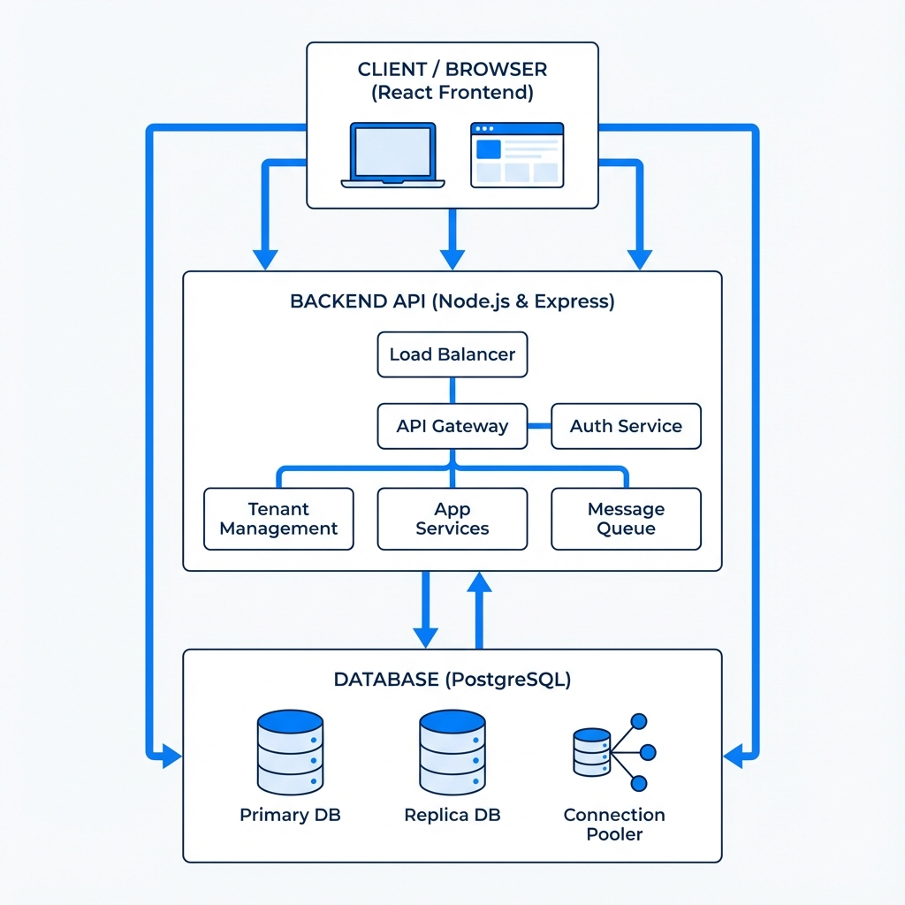
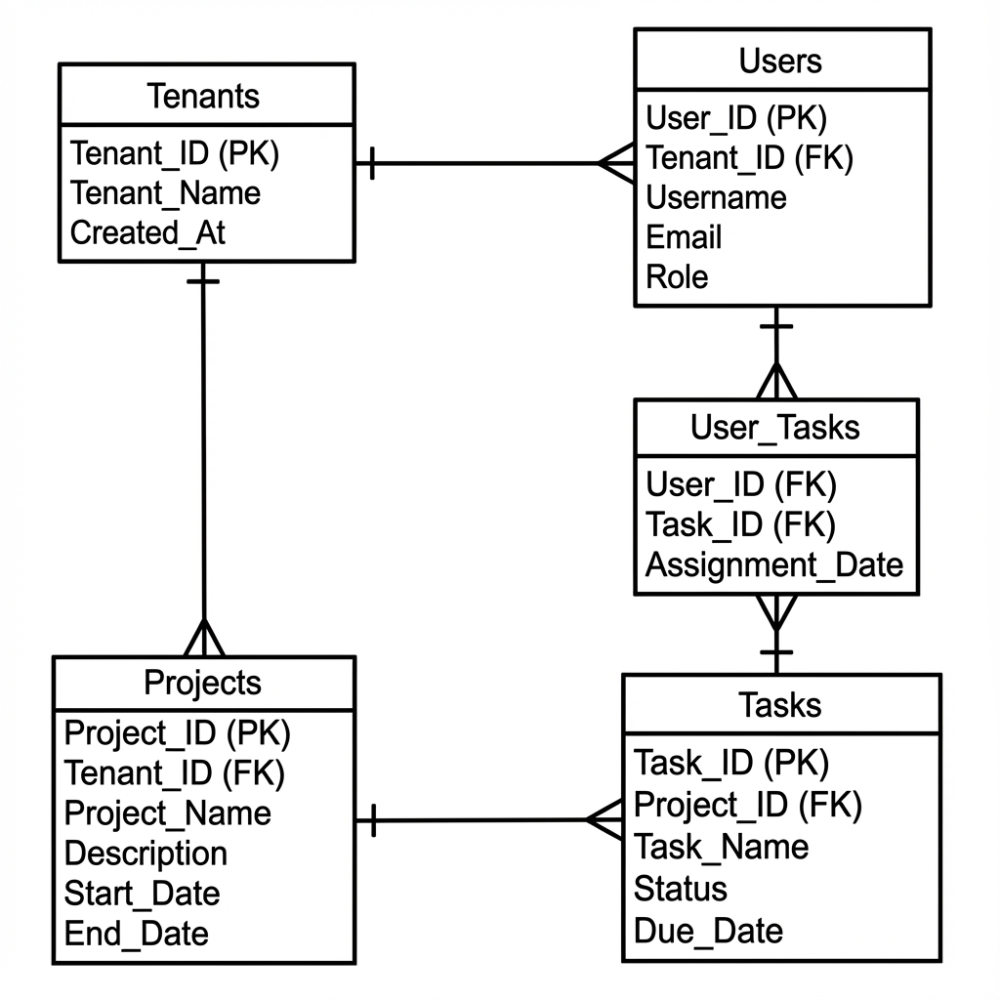

## **System Architecture Document**

**Project:** Multi-Tenant SaaS Platform – Project & Task Management System

---

## 1. High-Level System Architecture

The Multi-Tenant SaaS Platform follows a **three-tier architecture** consisting of:

1. **Client Layer (Browser)**
2. **Frontend Application**
3. **Backend API Server**
4. **Database Layer**

This architecture ensures scalability, security, and separation of concerns.

---

### **Architecture Flow**

```
[ Browser ]
     |
     v
[ Frontend (React) ]
     |
     | REST API (JWT)
     v
[ Backend (Node.js / Express) ]
     |
     v
[ PostgreSQL Database ]
```

---

### **Component Responsibilities**

#### **Client (Browser)**

- Renders UI
- Stores JWT token
- Sends authenticated API requests

#### **Frontend (React)**

- Handles routing and UI rendering
- Implements protected routes
- Displays role-based UI
- Communicates with backend APIs
- Manages authentication state

#### **Backend (Node.js + Express)**

- Exposes RESTful APIs
- Performs authentication and authorization
- Enforces tenant isolation
- Implements business logic
- Logs audit events

#### **Database (PostgreSQL)**

- Stores tenant, user, project, and task data
- Enforces relational integrity
- Provides ACID-compliant transactions

---

## 2. Authentication & Authorization Flow

### **Login Flow**

1. User submits email, password, and tenant subdomain
2. Backend validates credentials
3. Backend generates JWT token containing:

   - userId
   - tenantId
   - role

4. Token is returned to frontend
5. Frontend stores token and attaches it to future requests

---

### **Request Authorization Flow**

1. Frontend sends request with `Authorization: Bearer <token>`
2. Backend authentication middleware:

   - Verifies JWT signature
   - Checks token expiry

3. Authorization middleware:

   - Checks user role
   - Checks tenant access

4. Request reaches controller if authorized

---

## 3. Multi-Tenancy & Data Isolation Strategy

The platform uses **Shared Database + Shared Schema** multi-tenancy.

### **Tenant Identification**

- Each authenticated request contains tenantId from JWT
- Tenant ID is never accepted from client input
- Super admin users have `tenantId = NULL`

### **Tenant Isolation Rules**

- All queries filter data using `tenant_id`
- Super admin bypasses tenant filters
- Tasks derive tenant_id from associated project

This ensures **zero data leakage across tenants**.

---

## 4. Database Schema Design (ERD Explanation)

### **Entities & Relationships**

#### **Tenants**

- One tenant has many users
- One tenant has many projects
- One tenant has many tasks (via projects)

#### **Users**

- Belong to one tenant (except super admin)
- Can create projects
- Can be assigned tasks

#### **Projects**

- Belong to one tenant
- Created by a user
- Contain multiple tasks

#### **Tasks**

- Belong to one project
- Assigned to a user (optional)

#### **Audit Logs**

- Track system actions
- Belong to a tenant
- Linked to users optionally

---

### **ERD Relationships Summary**

```
Tenant ────< Users
Tenant ────< Projects ────< Tasks
Users ────< Tasks (assigned_to)
Users ────< Audit Logs
```

---

## 5. API Architecture

All APIs follow REST principles and return a consistent response format:

```
{
  success: boolean,
  message?: string,
  data?: object
}
```

---

### **API Modules**

#### **Authentication APIs**

- POST /api/auth/register-tenant
- POST /api/auth/login
- GET /api/auth/me
- POST /api/auth/logout

---

#### **Tenant Management APIs**

- GET /api/tenants/:tenantId
- PUT /api/tenants/:tenantId
- GET /api/tenants (super_admin only)

---

#### **User Management APIs**

- POST /api/tenants/:tenantId/users
- GET /api/tenants/:tenantId/users
- PUT /api/users/:userId
- DELETE /api/users/:userId

---

#### **Project Management APIs**

- POST /api/projects
- GET /api/projects
- PUT /api/projects/:projectId
- DELETE /api/projects/:projectId

---

#### **Task Management APIs**

- POST /api/projects/:projectId/tasks
- GET /api/projects/:projectId/tasks
- PATCH /api/tasks/:taskId/status
- PUT /api/tasks/:taskId

---

## 6. Role-Based Access Overview

| Role         | Permissions                                 |
| ------------ | ------------------------------------------- |
| super_admin  | Manage all tenants                          |
| tenant_admin | Manage users, projects, tasks within tenant |
| user         | View projects, update assigned tasks        |

---

## 7. System Diagrams

### System Architecture


### Database ERD
